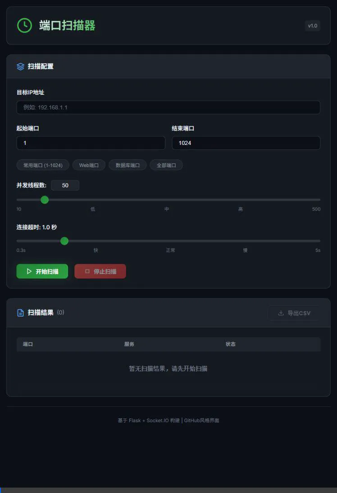

# 🔍 端口扫描器 (Port Scanner)

一个基于 Flask + Socket.IO 的现代化 Web 端口扫描工具，具有实时进度显示、断点续扫、结果导出等功能。


## ✨ 功能特性

- 🚀 **高性能并发扫描** - 支持 1-500 线程并发，快速扫描大范围端口
- 📊 **实时进度显示** - WebSocket 实时推送扫描进度和结果
- ⏸️ **断点续扫** - 支持暂停/继续扫描，不丢失已扫描结果
- 🎨 **现代化 UI** - GitHub 深色风格界面，美观易用
- 📥 **结果导出** - 支持导出扫描结果为 CSV 文件
- 🔧 **常用端口预设** - 内置常用端口、Web 端口、全端口等快捷选项
- 🏷️ **服务识别** - 自动识别常见服务（SSH、HTTP、FTP 等）

## 🖼️ 界面预览

扫描器采用 GitHub 深色主题风格，界面简洁现代：
- 顶部：扫描配置面板（IP、端口范围、线程数、超时设置）
- 中部：实时扫描进度条和统计信息
- 底部：扫描结果列表，支持导出 CSV

### 操作演示



## 📦 安装

### 环境要求
- Python 3.8+
- pip 或 conda/mamba

### 安装步骤

1. **克隆仓库**
   ```bash
   git clone https://github.com/stengger/port-scanner.git
   cd port-scanner
   ```

2. **创建虚拟环境**（推荐）
   ```bash
   # 使用 conda/mamba
   mamba create -n scan_env python=3.10
   mamba activate scan_env
   
   # 或使用 venv
   python -m venv venv
   source venv/bin/activate  # Linux/macOS
   venv\Scripts\activate     # Windows
   ```

3. **安装依赖**
   ```bash
   pip install -r requirements.txt
   ```

## 🚀 使用方法

1. **启动服务器**
   ```bash
   python app.py
   ```

2. **访问 Web 界面**
   
   打开浏览器访问：[http://localhost:5000](http://localhost:5000)

3. **开始扫描**
   - 输入目标 IP 地址
   - 设置端口范围（或使用预设按钮）
   - 调整线程数和超时时间
   - 点击「开始扫描」

## ⚙️ 配置说明

| 参数 | 范围 | 默认值 | 说明 |
|------|------|--------|------|
| 并发线程数 | 1-500 | 50 | 同时扫描的最大连接数 |
| 连接超时 | 0.3-5s | 1.0s | 单个端口的连接超时时间 |

> 💡 **提示**：扫描远程服务器时，建议将超时设置为 2-3 秒以避免漏扫。

## 📁 项目结构

```
port-scanner/
├── app.py              # Flask 主程序
├── scanner.py          # 独立端口扫描模块
├── requirements.txt    # Python 依赖
├── demo.webp           # 操作演示动图
├── .gitignore          # Git 忽略配置
├── templates/
│   └── index.html      # 前端页面
├── static/
│   ├── css/
│   │   └── style.css   # 样式文件
│   └── js/
│       └── main.js     # 前端逻辑
└── README.md
```

## ⚠️ 注意事项

1. **代理软件**：如果使用 V2Ray、Clash 等代理软件的 TUN 模式，请在扫描时关闭或配置直连规则，否则可能导致误判。

2. **合法使用**：请仅扫描您有权限测试的目标，未经授权的端口扫描可能违反法律。

3. **防火墙**：目标服务器的防火墙可能会限制扫描结果，某些端口可能被过滤。

## 📄 开源协议

本项目采用 [MIT License](LICENSE) 开源协议。

## 🤝 贡献

欢迎提交 Issue 和 Pull Request！
